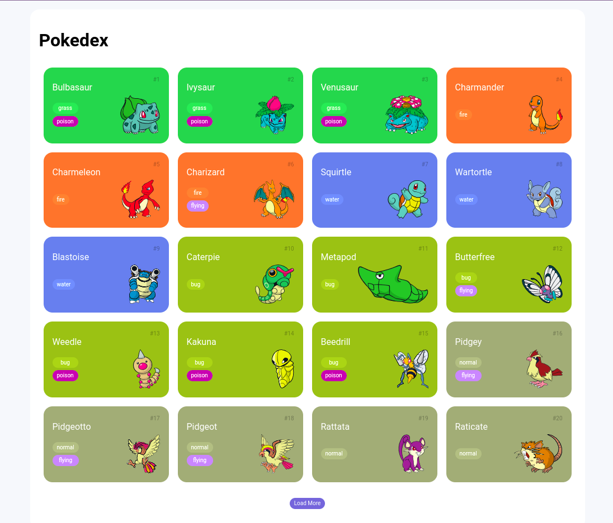

<h1 align="center">Pokedex com Javascript</h1>

  
  

  

## 🌱 Projeto 

Criar um Projeto com HTML/CSS para listagem de Pokémon

## 📌 Conteúdos abordados

| CSS |
| --- |
| Normalize CSS |
| Mobile First |
| Responsividade |
| Media Querys |

| Protocolo HTTP |
| -------------- |
| Requisições |
| URL Path e Method |
| Path Params e Query String |
| Headers |
| Body e Status Code |

| Javascript |
| ---------- |
| Consumo de API |
| http-server |
| Manipulação de resultados de requisição |
| Promises |
| Fetch | 
| Async Functions |
| Manipulação de HTML dinamicamente |
| Função MAP |
| Manipulação de múltiplas requisições em paralelo |
| Paginação | 

## 📄 Referências

- [Normalize](https://cdnjs.com/libraries/normalize)
- [Docunetação - PokeApi](https://pokeapi.co/docs/v2)
- [CSS Media Querys](https://www.w3schools.com/css/css3_mediaqueries_ex.asp)
- [NPM http-server](https://www.npmjs.com/package/http-server)
- [Roboto font](https://fonts.google.com/specimen/Roboto)
- [URL - Biblioteca de imagens - Mudando o número no fim da url, muda respectivamento a imagem do pokemon](https://raw.githubusercontent.com/PokeAPI/sprites/master/sprites/pokemon/other/dream-world/1.svg)
- [Fetch Api](https://developer.mozilla.org/en-US/docs/Web/API/Fetch_API)
- [Promise](https://developer.mozilla.org/en-US/docs/Web/JavaScript/Reference/Global_Objects/Promise)